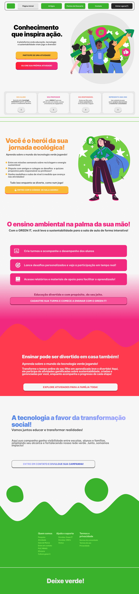
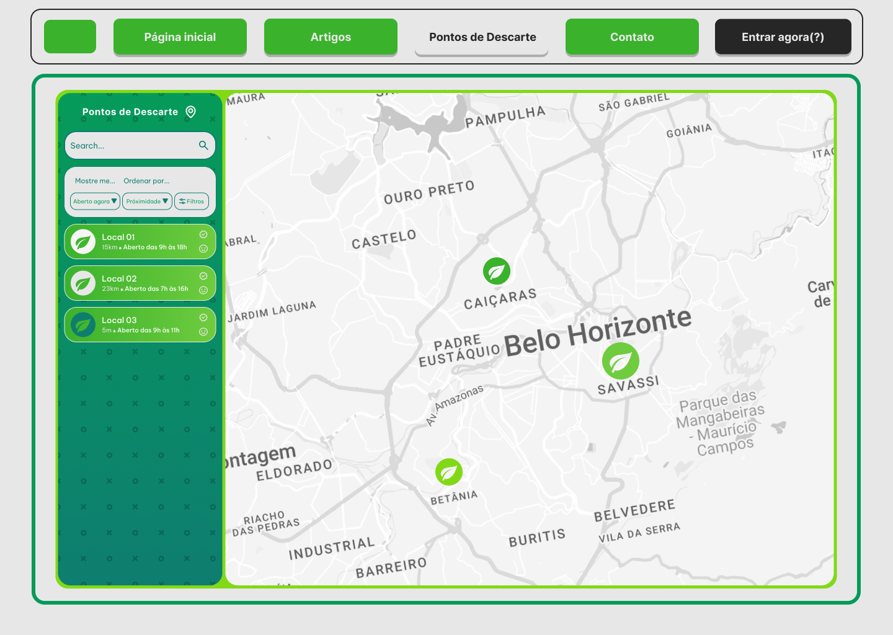
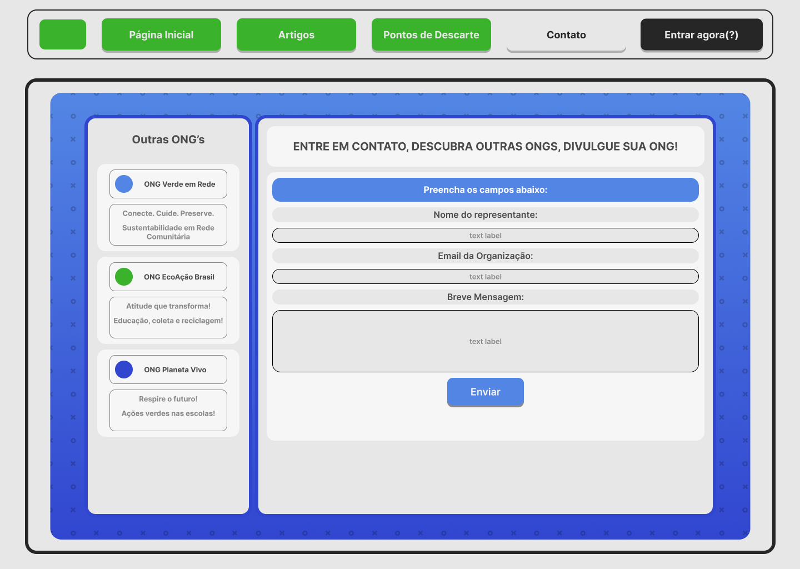
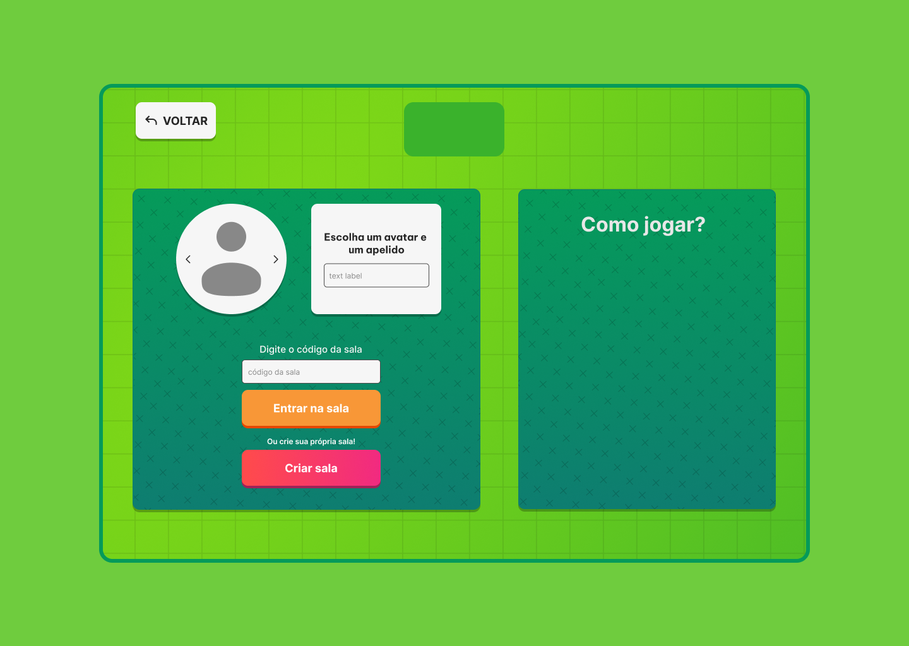
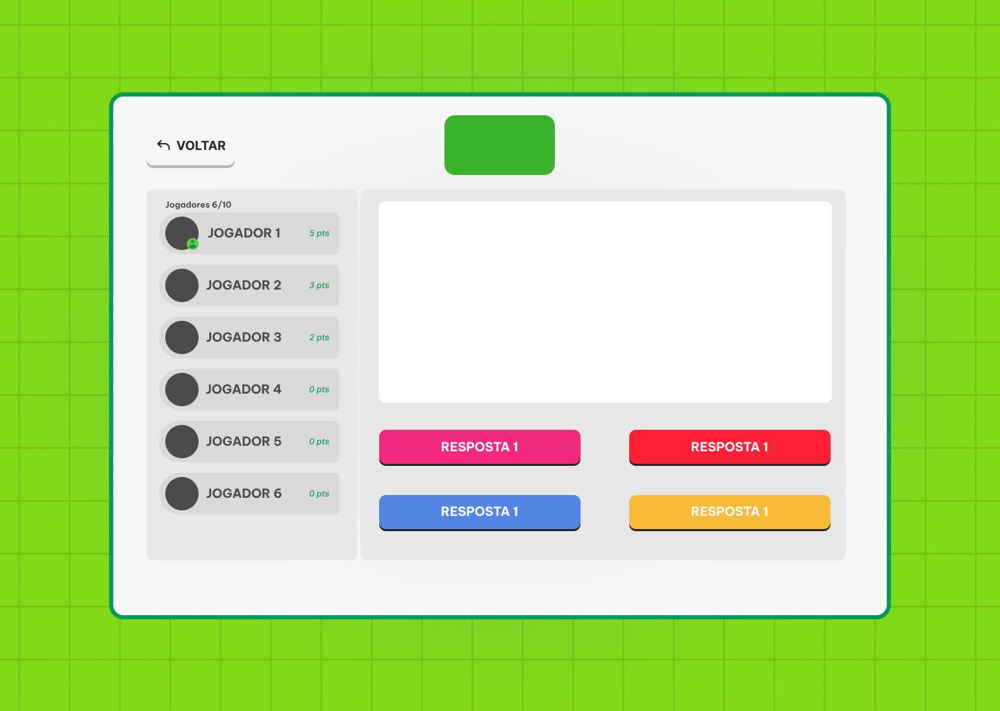
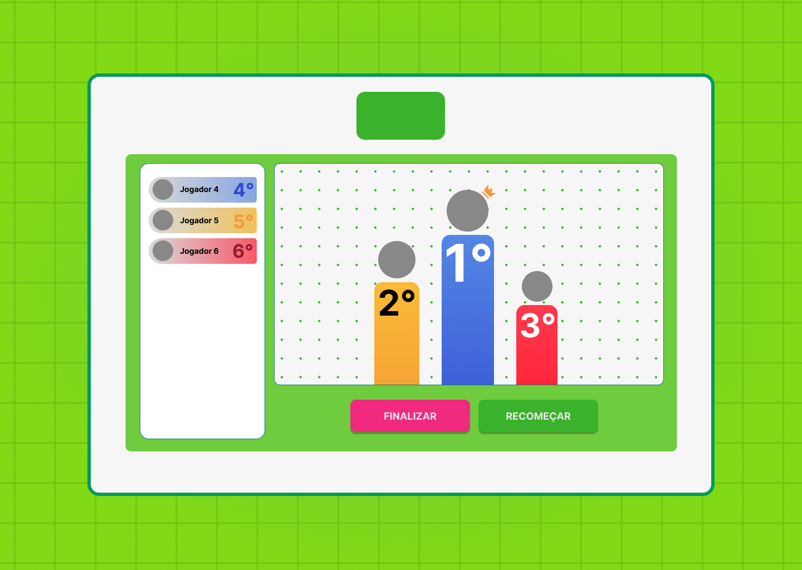
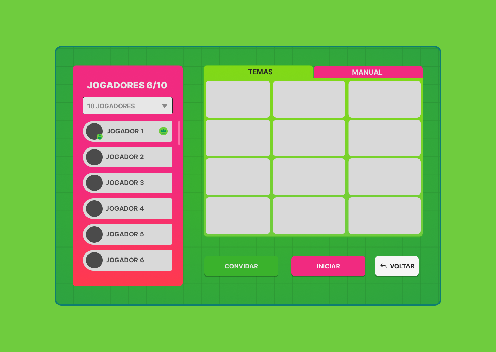
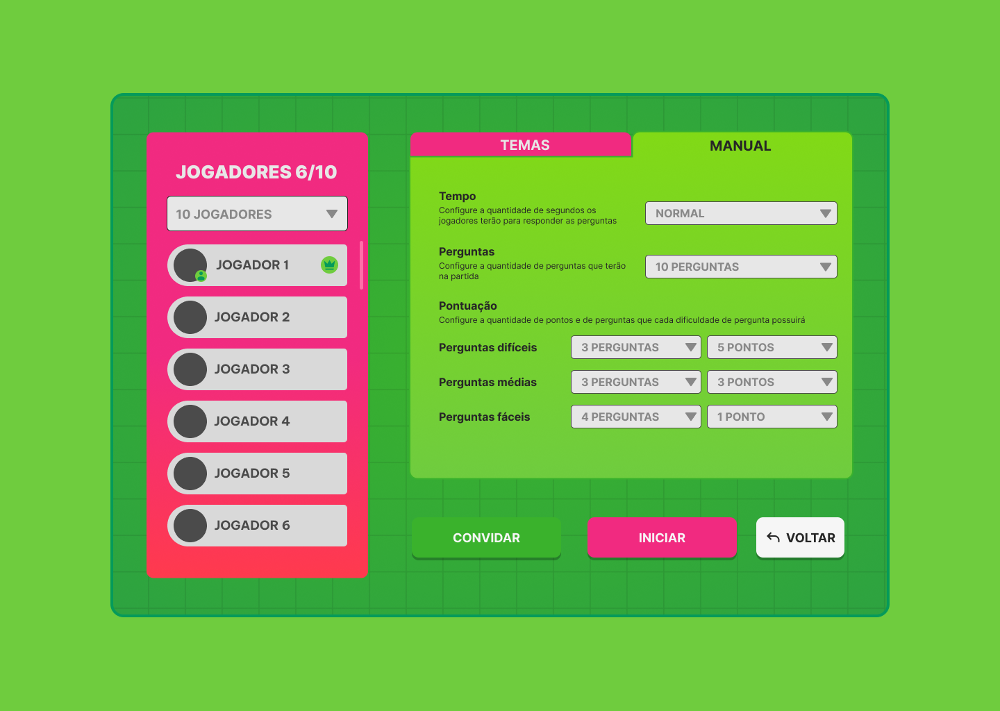
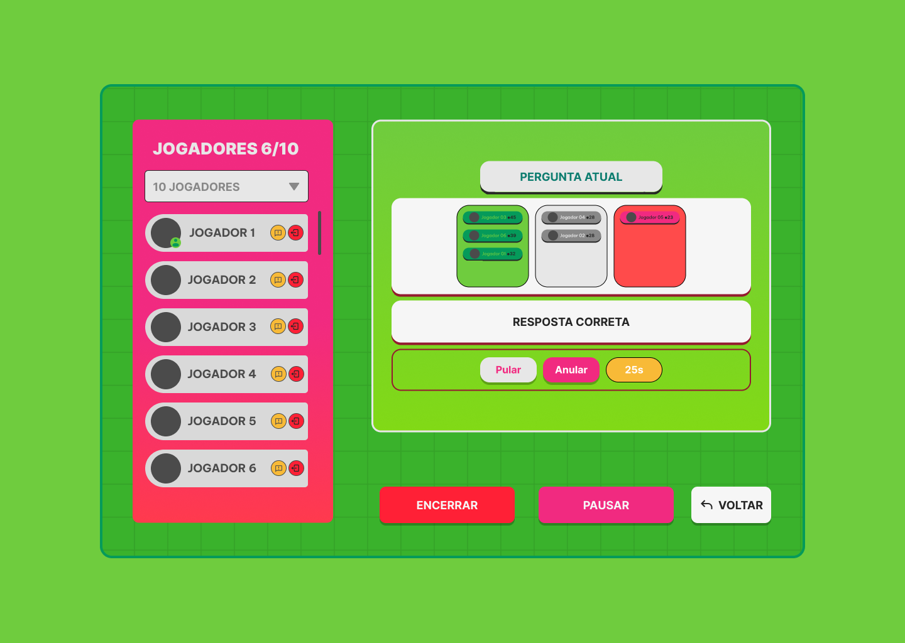

## User Flow

### Tela Inicial

A tela inicial apresenta um menu lateral com as principais seções do portal, enquanto a navigation bar, ao topo, apresenta informações de envio de imagens ou navegação pela galeria de fotos. A área central apresenta a galeria de fotos na forma de uma grade. Nesta tela, são apresentados os seguintes requisitos

### Tela de Artigos e Notícias

Tela Apresenta uma barra lateral com artigos e noticias em destaque para escolha do usuário. Tambem apresentando as ultimas noticias de forma variada á direita.

### Tela de Pontos de Descarte

Tela apresenta um mapa para localização dos pontos de descarte de lixo eletrônico, junto a barra lateral com os pontos já definidos e também uma barra de pesquisa para procura de alternativas de pontos de descarte.

### Tela de Contato para ONG's

Tela apresenta campos para digitação de dados de ONG's para contato.

### Tela Inicial de Atividade Interativa

Tela apresenta um campo para digitação de nickname e a escolha de avatar, também aparece um campo para digitar o código de uma sala de atividades já criada e uma opção de criar a sala.

### Tela de Atividade Interativa em ação

Tela apresenta uma das possíveis atividades interativas, com uma representação de posição dos jogadores e opções de resposta para as atividades.

### Tela de Placar Final da Atividade Interativa

Tela apresenta a posição final dos jogadores em formato de pódio.

### Tela de Criação de Atividade Interativa

Tela mostra a criação de uma atividade interativa.

### Tela de Configuração de Atividade Interativa

Tela mostra as possíveis configurações no processo de criação de sala.

### Tela de Gerenciamento de Atividade Interativa

Tela mostra as possíveis opções para gerenciamento da sala de atividades.

> - [Figma](https://www.figma.com/)
> - [Adobe XD](https://www.adobe.com/br/products/xd.html#scroll)
> - [Axure](https://www.axure.com/edu) (Licença Educacional)
> - [InvisionApp](https://www.invisionapp.com/) (Licença Educacional)
